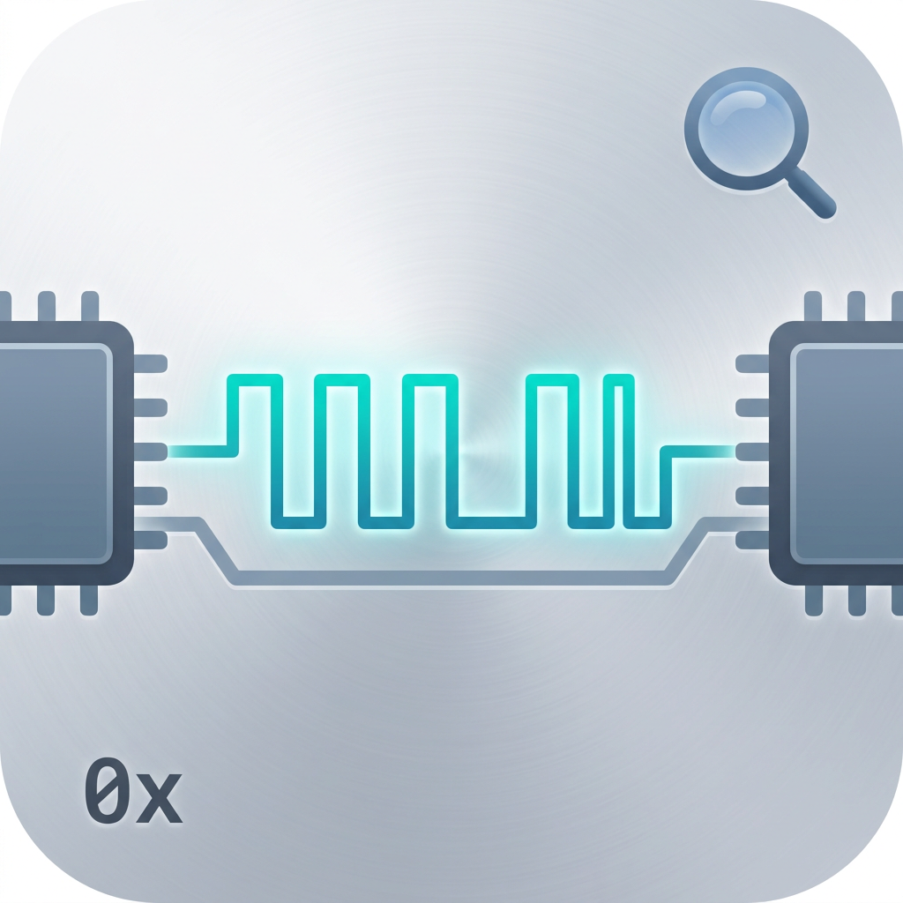

# CAN Log Analyzer Pro

一款本地运行的 **CAN / CAN FD 日志分析与信号解码**桌面工具（Electron + React）。

解析 `ASC` / `BLF` 总线日志，结合 `DBC` 数据库文件进行**信号级解码**，并以「数值表格 + 曲线图 + 位布局视图」三种视图呈现。同时支持**物理量 CSV 逆向生成 CAN 报文**（含 CRC 自动计算），适用于数据回放、标定验证与 HIL 仿真激励。



---

## 功能特性

- **多格式解析**
  - `ASC`：Vector CANalyzer 文本日志（支持普通 CAN 与 CAN FD）
  - `BLF`：Vector 二进制日志（CAN / CAN FD 对象块）
  - `DBC`：CANdb++ 数据库（`BO_` / `SG_` / `VAL_` / `CM_` / `BA_` 属性 / `SIG_VALTYPE_`，支持 factor/offset、Intel/Motorola 字节序、枚举、多路复用、浮点信号）
  - 物理量 `CSV`：首行为表头，`t` 列为时间戳，其余列与 DBC 信号名对应
- **CAN FD 64 字节**：DBC 可定义 DLC=64 的消息，信号位可延伸至 B63（bit 511），布局视图按 DLC 动态渲染 B0–B63
- **信号级解码**：物理值 = 原始值 × factor + offset；表格展示物理值、原始字节与解码位
- **曲线图**：基于 Recharts，支持缩放/平移、图例点击显隐曲线、Y 轴自适应（常值曲线也可读）
- **位布局视图**：直观展示每个信号在报文中的字节/位分布，色块与曲线颜色一一对应
- **报文日志**：时间 / ID / 名称 / DLC / 数据 HEX 列表，支持过滤与行内 DBC 解码
- **导出与转换**：报文日志 / 信号表格导出 CSV（默认命名 `<源>_filtered_<时间戳>`）、过滤后报文导出 ASC、`ASC→BLF` 格式转换
- **工程保存/恢复**：`.claproj` 工程文件保存/打开，一键恢复日志源 + DBC + 勾选信号与分析现场
- **最近文件 + 偏好持久化**：log / dbc / project 三类最近文件（上限 10 条）；窗口与界面偏好自动落盘 `settings.json`，重启自动恢复；双击 `.claproj` 直接打开
- **物理量 CSV → ASC**：按 DBC factor/offset 反算原始字节打包 CAN 帧，支持 CRC8/CRC16 系列校验自动填充（或保留 CSV 原始值）
- **内置操作手册**：应用右上角「使用手册」按钮随时查阅

---

## 快速开始

### 环境要求

- Node.js 18+（含 npm）
- 开发模式跨平台；打包发布面向 Windows（electron-builder，NSIS + Portable）

### 安装依赖

```bash
npm install
```

### 浏览器预览（开发）

```bash
npm run dev
```

### Electron 桌面调试

```bash
npm run electron:dev
```

### 运行单元测试

```bash
npm test
```

### 构建发布（Windows 安装包 + 便携版）

```bash
npm run electron:build
```

产物输出至 `release/`：

| 文件 | 说明 |
|---|---|
| `CAN Log Analyzer Pro Setup <版本>.exe` | NSIS 安装版（可自定义安装目录、创建桌面/开始菜单快捷方式） |
| `CAN Log Analyzer Pro-Portable-<版本>.exe` | 便携版（单文件免安装） |
| `win-unpacked/` | 免打包目录，可直接运行 `CAN Log Analyzer Pro.exe` |
| `latest.yml` | electron-updater 自动更新元数据 |

> 发布说明：正式发布统一使用 `package.json` 的 `build.directories.output`（输出到 `release/`），一条命令 `npm run build` 产出安装版、便携版与 `win-unpacked/`。`release/`、`backup/` 等目录已被 `.gitignore` 排除，不进入版本库。

---

## 使用手册

应用右上角「使用手册」按钮内置了完整手册，以下为摘要。

### 一、快速上手（四步完成首次分析）

1. **加载日志**：点击工具栏「加载 ASC」或「加载 BLF」，选择日志文件（普通 CAN / CAN FD 均可）。
2. **加载 DBC**：点击「加载 DBC」，选择对应的 DBC 数据库文件。
3. **勾选信号**：在左侧「DBC 结构与信号布局」面板展开消息，勾选需要分析的信号（支持消息级全选/单选）。
4. **查看结果**：右侧「信号解析」页签自动生成**数值表格**与**曲线图**，底部为**位布局视图**。

### 二、DBC 结构与信号布局面板（左侧）

- **搜索**：按消息名 / ID / 信号名检索（如 `0x100` 或 `Speed`）；头部「清空」按钮一键清空搜索框。
- **消息列表**：显示 ID（十六进制）、名称、发送/接收节点、DLC 字节数及信号数量。点击消息行展开/折叠信号列表；展开列表固定约 8 行可见，超出显示**滚动条**，避免长信号列表遮挡右侧布局。
- **信号行**：`startBit|length@字节序 符号` 与 factor/offset 一览；勾选即选择该信号，行首色块与曲线颜色对应。
- **布局视图**：按消息 DLC 动态渲染字节行（CAN FD 64 字节显示 B0–B63），色块标注各信号占用位，悬停显示信号名与位信息。
- **工具按钮**：「全选信号 / 取消全选」「DBC 原文」（弹窗查看原始 DBC 内容）「重新加载」。

### 三、信号解析页签

- **数值表格**：时间戳 / 消息 ID / 各信号物理值；数据量大时自动抽样（可调整步长）。
- **曲线图**：时间戳为横轴，支持缩放/平移、图例点击显隐曲线、Y 轴自适应。
- **字节视图**：同步展示每个信号的原始字节与解码位（HEX），便于核对字节序与位偏移。

### 四、CAN 报文日志页签

- 报文表：时间 / ID / 名称 / DLC / 数据 HEX，ID 颜色标注（未在 DBC 定义的 ID 为灰色）。
- 过滤：按 ID / 方向过滤，快速聚焦目标报文。
- 行内 DBC 解码：结合 DBC 实时解码已知信号为物理值列。
- **导出 ASC**：将当前报文列表写回 ASC 文件，实现数据裁剪/重组。

### 五、物理量 CSV 页签

1. **加载 CSV**：首行表头，`t` 列时间戳（秒，可含小数），其余列名与 DBC 信号名一致（大小写不敏感）。
2. **选择 CRC 算法**：CRC8/CRC16 系列或 NONE（选择 NONE 保留 CSV 原始校验值）。
3. **转换为 ASC**：按 DBC factor/offset 反算原始字节 → 打包 CAN 帧（时间戳/通道/方向）→ 生成并自动载入 ASC。

### 六、工程保存 / 最近文件 / 偏好设置

- **保存工程**：菜单「文件 → 保存工程（.claproj）」把当前工作现场（日志源路径 + DBC 路径 + 勾选信号/参数）写入工程文件；「打开工程」或**双击 `.claproj`**（文件关联）一键恢复现场。
- **最近文件**：「文件 → 最近文件」子菜单列出最近打开过的日志 / DBC / 工程（三类合并，上限 10 条，去重置顶），点击直接打开。
- **偏好持久化**：界面偏好（窗口尺寸、最近文件等）自动保存至系统用户数据目录 `settings.json`，下次启动自动恢复，无需手动配置。

### 七、数据导出（CSV / BLF / ASC）

- **报文日志 CSV**：在「CAN 报文日志」页签过滤后点「导出为 CSV」，导出当前过滤结果，默认命名 `<源>_filtered_<时间戳>.csv`；大文件按 5000 行/块流式写盘，界面显示导出进度。
- **信号 CSV**：在「信号解析」页签点「导出为 CSV」，导出时间戳 + 勾选信号物理值；枚举值导出为文本标签、缺失值留空、含逗号字符串自动加引号。
- **BLF**：日志或转换面板「导出 BLF」，将当前报文写为 BLF 二进制（默认命名 `<源>_filtered_<时间戳>.blf`）。
- **ASC**：报文列表「导出 ASC」可将过滤/裁剪后的数据写回 ASC 文本。
- 所有导出在完成/失败时均有提示，大文件导出过程可随时看到进度，不会假死界面。

### 八、UI 增量与快捷键

- **解析错误徽章**：加载含坏行/坏块的日志后，工具栏出现黄色警示徽章，点击打开错误报告抽屉，可「导出为 txt」。
- **空态提示**：未加载日志 / 未勾选信号 / 无匹配数据时均有明确的空态说明，不再空白无反馈。
- **常用快捷键**（原生菜单）：`Ctrl+O` 打开 ASC、`Ctrl+Shift+O` 打开 BLF、`Ctrl+D` 加载 DBC、`Ctrl+Shift+P` 打开工程、`Ctrl+S` 保存工程、`Ctrl+E` 导出 ASC、`Ctrl+Shift+Delete` 清空所有数据、`F1` 使用手册；CSV / BLF 导出与格式转换在对应页签/工具栏按钮执行，完整列表见菜单或内置手册。

### 九、常见问题

- **曲线看不到？** 点击图例曲线名显隐；常值曲线贴近 Y 轴，可先隐藏其他曲线后再查看。
- **数值与预期不符？** 检查 DBC factor/offset（物理值 = raw × factor + offset）与字节序（Intel=小端 / Motorola=大端）。
- **CAN FD 64 字节只显示 8 个字节？** 确认 DBC 中该消息为 `BO_ ID NAME: 64 SENDER`（DLC=64），布局视图才会渲染 B0–B63。
- **数据量大卡顿？** 表格与曲线自动抽样；减少勾选信号或增大抽样步长。
- **如何将 CSV 物理量转成报文？** 「物理量 CSV」页签 → 加载 CSV → 选择 CRC → 转换为 ASC。

---

## 示例数据

`TestExample/` 目录包含可直接用于体验的样例：

| 目录 | 内容 |
|---|---|
| `canfd_rich/` | **CAN FD 丰富场景**：`vehicle_canfd.asc` + `vehicle_canfd.blf`（30 帧，15 帧 64 字节 VCU 报文 + 15 帧 32 字节 BMS 报文）、`vehicle_canfd.dbc`（2 条消息 64 个信号，信号覆盖 B0–B63）、`generate.js`（数据生成脚本） |
| 其他目录 | 普通 CAN 的 ASC / BLF / DBC 样例 |

> `canfd_rich/generate.js` 演示了如何调用 `electron/asc.js`、`electron/blf.js`、`electron/dbc.js` 生成日志并解码验证，可作为二次开发参考。

---

## 项目结构

```
├── electron/                  # Electron 主进程
│   ├── main.js                # 窗口、应用菜单、IPC、文件对话框
│   ├── preload.js             # 安全桥接 API（contextBridge）
│   ├── asc.js                 # ASC 解析 / 生成
│   ├── blf.js                 # BLF 解析 / 生成
│   ├── dbc.js                 # DBC 解析 / 信号编码解码
│   └── __tests__/             # 后端单元测试
├── src/                       # React 渲染进程
│   ├── App.jsx                # 主界面布局、工具栏、页签管理
│   ├── index.css
│   └── components/
│       ├── DBCPanel.jsx       # DBC 结构 / 信号选择 / 位布局
│       ├── SignalLayoutView.jsx # 字节位布局图
│       ├── SignalParsePanel.jsx # 信号解析（表格 + 曲线）
│       ├── SignalTable.jsx    # 信号数值表格
│       ├── SignalChart.jsx    # 曲线图（Recharts）
│       ├── MessageTable.jsx   # CAN 报文日志 + 导出 ASC
│       ├── ExportPanel.jsx    # ASC→BLF 等导出
│       ├── CSVPanel.jsx       # 物理量 CSV → ASC（含 CRC）
│       ├── HelpModal.jsx      # 内置使用手册弹窗
│       └── __tests__/         # 组件单元测试
├── public/                    # 静态资源（logo 等）
├── TestExample/               # 示例日志 / DBC / 生成脚本
├── package.json               # 构建配置（build.directories.output 指向 release/）
├── vite.config.js
└── vitest.config.js
```

---

## 测试

```bash
npm test
```

覆盖范围：

- `electron/__tests__/`：ASC / BLF 解析与生成、DBC 解析（BA_ 属性 / 扩展帧标志位 / mux / SIG_VALTYPE_ 浮点）、信号解码（含 CAN FD 64 字节丰富场景）、Motorola 位序回归矩阵（start≡7 专项 + 生成 ≥60 布局交叉验证，锯齿语义）、解析容错（坏行/坏块跳过并报告）、R2 分块与一次性解码双路径收敛（随机 20000 帧 × 4 种 chunk 尺寸，位级一致）
- `src/components/__tests__/`：DBC 面板（搜索/清空/滚动、周期/Ext/mux 徽标）、信号表格（浮点 6 位有效数字）、曲线图、布局视图、报文表（扩展帧匹配）、使用手册弹窗、解析错误报告 UI、工程保存/恢复与最近文件（R5）、CSV 导出（R7）
- 全量 **162/162** 通过（12 个测试文件）；另有 `TestExample/*/generate.js` 样例自校验与 `compare.js`（cantools 对拍，缺失时跳过、加载失败必报错）

---

## 许可证

MIT License。详情见 [LICENSE](LICENSE)。
